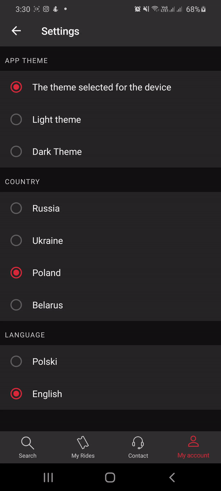

# react-native-touchable


[](https://www.npmjs.com/package/@busfor/react-native-touchable)


React Native universal Touchable component.

<div>


</div>

---

## Getting started

`$ yarn add @busfor/react-native-touchable`

## Usage

```javascript
import { Touchable } from '@busfor/react-native-touchable'
```

```jsx
<Touchable
  onPress={() => console.log('It works!')}
  // ...other TouchableOpacity props
>
  ...
</Touchable>
```
